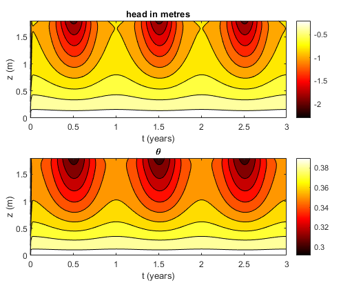

# RESolve

Suite of Matlab codes codes to solve the Richards Equation in 1D.

# Project overview:

* Theory and code analysis is documented in notes1.pdf
* Sample code (in Matlab) is provided in SAMPLE/

